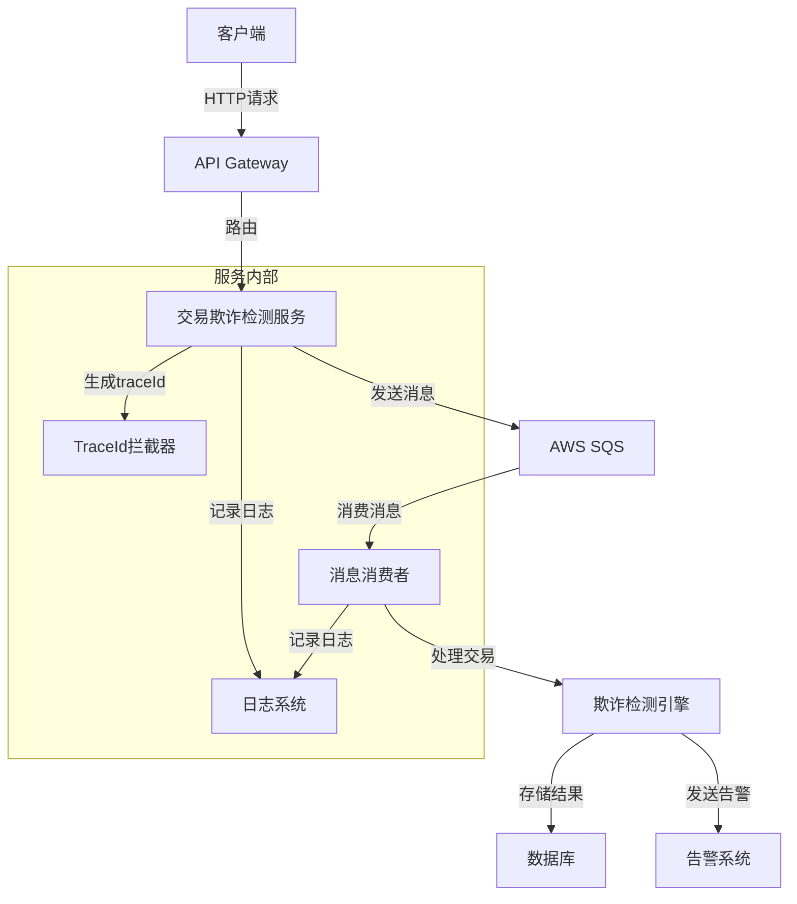

# 交易欺诈检测系统

## 项目简介
基于Spring Boot和AWS SQS的分布式交易欺诈检测系统，提供实时交易监控和欺诈检测功能。

## 系统架构


## 技术栈
- Spring Boot 2.7.x
- AWS SDK for Java
- AWS SQS
- SLF4J + Logback
- Maven

## 核心功能
1. 交易数据接收与处理
   - REST API接口
   - AWS SQS消息队列
   - 异步消息处理

2. 欺诈检测
   - 实时交易监控
   - 多维度风险分析
   - 可配置的检测规则

3. 系统监控
   - 分布式追踪（traceId）
   - 多维度日志记录
   - 性能监控

## 日志系统
系统采用多维度日志记录策略：
- 系统日志：记录系统运行状态
- 业务日志：记录业务操作
- 错误日志：记录异常信息
- SQS日志：记录消息队列操作

日志格式：
```
[时间] [traceId] [requestId/messageId] [线程] 日志级别 日志器 - 消息
```

## 快速开始

### 环境要求
- JDK 1.8
- Maven 3.6+
- AWS账号及访问凭证

### 配置说明
1. AWS凭证配置
```yaml
aws:
  credentials:
    access-key: your-access-key
    secret-key: your-secret-key
  region: eu-north-1
```

2. SQS配置
```yaml
sqs:
  queue-name: fraud-detection-queue
  endpoint: https://sqs.eu-north-1.amazonaws.com
```

### 构建与运行
```bash
# 构建项目
mvn clean package

# 运行服务
java -jar target/fraud-detection-service.jar
```

## API接口

### 交易接口
- POST /api/transactions
  - 接收交易数据
  - 返回交易ID和状态

### 监控接口
- GET /actuator/health
  - 服务健康检查
- GET /actuator/metrics
  - 性能指标监控

## 部署说明
系统支持以下部署方式：
1. 本地运行
2. Docker容器
3. Kubernetes集群

### Kubernetes部署
```yaml
apiVersion: apps/v1
kind: Deployment
metadata:
  name: fraud-detection-service
spec:
  replicas: 3
  template:
    spec:
      containers:
      - name: fraud-detection
        image: fraud-detection-service:latest
        ports:
        - containerPort: 8080
```

## 开发规范
1. 代码风格
   - 遵循阿里巴巴Java开发手册
   - 使用Checkstyle进行代码规范检查

2. 日志规范
   - 使用SLF4J进行日志记录
   - 遵循日志级别使用规范
   - 包含必要的上下文信息

3. 异常处理
   - 使用自定义异常类
   - 合理的异常层级
   - 完整的异常信息

## 监控与告警
1. 性能监控
   - CPU使用率
   - 内存使用率
   - 线程状态
   - GC情况

2. 业务监控
   - 交易处理量
   - 欺诈检测准确率
   - 系统响应时间

## 贡献指南
1. Fork项目
2. 创建特性分支
3. 提交更改
4. 推送到分支
5. 创建Pull Request

## 许可证
MIT License

## AWS SQS配置说明

在使用AWS SQS进行消息队列集成时，需要正确配置AWS凭证。错误的示例如下：

```
2025-04-13 20:11:15.338 DEBUG 27476 --- [   scheduling-1] c.e.f.messaging.SqsAwsConsumer           : 从FIFO队列接收消息
2025-04-13 20:11:15.740 ERROR 27476 --- [   scheduling-1] c.e.f.messaging.SqsAwsConsumer           : 从SQS接收消息时发生错误

software.amazon.awssdk.core.exception.SdkClientException: Unable to load credentials from any of the providers in the chain...
```

### 配置AWS凭证

有两种方式配置AWS凭证：

#### 1. 通过application.yml配置

在`application.yml`中添加以下配置：

```yaml
aws:
  region: eu-north-1  # 替换为您的AWS区域
  credentials:
    access-key: YOUR_AWS_ACCESS_KEY  # 替换为您的访问密钥
    secret-key: YOUR_AWS_SECRET_KEY  # 替换为您的秘密密钥
```

#### 2. 通过环境变量配置

设置以下环境变量：

```
AWS_ACCESS_KEY_ID=YOUR_AWS_ACCESS_KEY
AWS_SECRET_ACCESS_KEY=YOUR_AWS_SECRET_KEY
AWS_REGION=eu-north-1
```

### 注意事项

- 请确保使用的AWS凭证具有对SQS队列的完整操作权限
- 不要在公共代码仓库中提交包含实际AWS凭证的配置文件
- 在生产环境中，建议使用环境变量或AWS IAM角色提供凭证，而不是硬编码在配置文件中

### SQS队列配置

当前系统使用的SQS队列URL:

```
transaction-queue-url: https://sqs.eu-north-1.amazonaws.com/399423262812/transaction-queue.fifo
```

请确保这些队列已在AWS SQS控制台中创建，并且您的AWS凭证有权访问它们。 